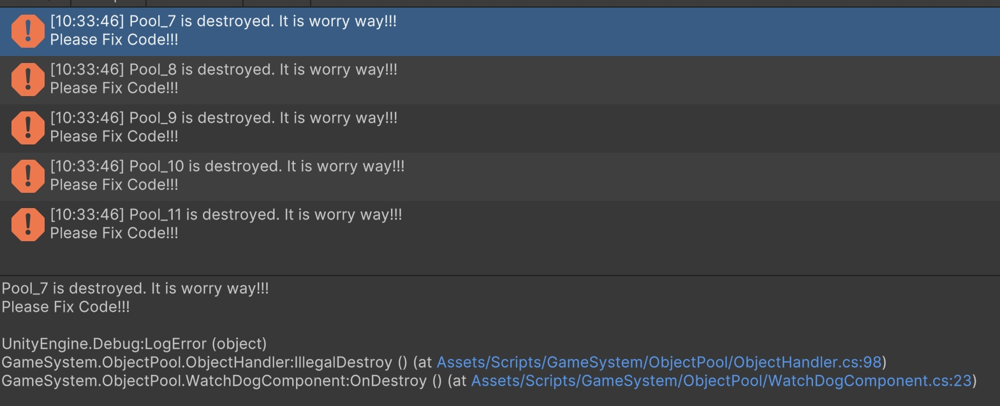

# 通常な使い方
```csharp
    //オブジェクトを取得する
    var handler = _pool.Get();
    handler.instance.transform.SetParent(transform);
    handler.instance.SetActive(true);
    //2秒後返却する
    PrimeTween.Tween.Delay(
        this, 
        duration: 2.0f, 
        onComplete: () => handler.Release());
```
# 借りたオブジェクト、親ノードにアタッチしてない場合
 - 下記のコード借りたオブジェクトを親ノードにアタッチしてないという場合ではオブジェクトが逸脱したがプールが適切に回収できる
```csharp
    var handler = _pool.Get();
    handler.instance.SetActive(true);
```

# 意外と廃棄された場合
親ノードが廃棄された場合
```csharp
    //プールから取得する
    for (int i = 0; i < 5; i++)
    {
        var h = _pool.Get();
        h.instance.SetActive(true);
        h.instance.transform.SetParent(transform);
    }
    //2秒後勝手に借りたオブジェクトを廃棄する
    PrimeTween.Tween.Delay(
        this, 
        duration: 2.0f, 
        onComplete: () => Destroy(this.gameObject));
```

借りたオブジェクトが無闇に破棄する
```csharp
    var handler = _pool.Get();
    Destroy(handler.instance);
```

エラーがすぐ出てきました


# 借りたオブジェクトを複数回にreleaseされる

```csharp
    var handler = _pool.Get();
    handler.Release();
    handler.Release();
    handler.Dispose();
```

# 返却した後に使い続ける
```csharp
    var handler = _pool.Get();
    handler.Release();
    //すぐエラーが出る
    handler.instance.SetActive(true);
    handler.instance.transform.SetParent(transform);
```

# 自動で滑らかに拡大したり縮小したりする
```csharp
public class GameObjectPool
{
    public ObjectHandler Get()
    {
        //貸し出し際に 貸出回数を記録する
        //一定時間内で最大貸出数を記録する
        _currentBorrowed++;
        _maxBorrowed = Mathf.Max(_currentBorrowed, _maxBorrowed);
    }
    public void Release(ObjectHandler handler)
    {
        _currentBorrowed--;
    }

    public void LateUpdate()
    {
        //設定時間が経ったら
        _smoothedPeak = alpha * _maxBorrowed + (1.0f - alpha) * _smoothedPeak;
        int targetPoolNum = Mathf.CeilToInt(_smoothedPeak * 1.2f);
        ShrinkOrExpandTo(targetPoolNum);
    }

    private void ShrinkOrExpandTo(int targetPoolNum)
    {
        int current = _pool.Count;
        
        if (current == targetPoolNum)
            return;
        
        float changePercent = Mathf.Abs(targetPoolNum - current) / (float)current;
        //頻繁に操作を避けるため
        if (changePercent < 0.25f)
            return;

        if (targetPoolNum < current)
        {
            // shrink
            int toRemove = current - targetPoolNum;
            for (int i = 0; i < toRemove; i++)
            {
                var obj = _pool.Dequeue();
                Destroy(obj);
            }
            Debug.Log($"{name} shrink out of {toRemove}.");
        }
        else
        {
            // expand
            int toAdd = targetPoolNum - current;
            MakeMore(toAdd);
            Debug.Log($"{name} expand {toAdd}.");
        }
    }
}
```

# 便利なツール

# アイコン

